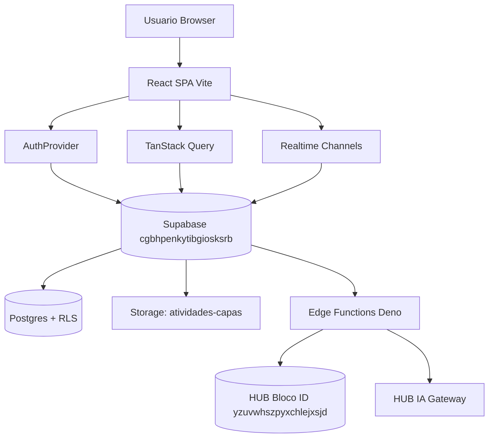

# Arquitetura

## Índice
- [Visão geral](#visão-geral)
- [Frontend](#frontend)
- [Backend Supabase](#backend-supabase)
- [Edge Functions](#edge-functions)
- [Realtime](#realtime)
- [Storage](#storage)
- [Integração com o HUB](#integração-com-o-hub)
- [Autenticação](#autenticação)
- [Fluxo de IA](#fluxo-de-ia)

## Visão geral

## Frontend
- **SPA React 18 + Vite 5**. Roteamento client-side (`react-router-dom` v6).
- **State**: `TanStack Query` para dados remotos; contextos leves (`AuthProvider`, `ThemeProvider`) para sessão/tema.
- **UI**: shadcn/ui + Tailwind; tokens semânticos HSL em `src/index.css`.
- **Realtime**: hooks (`useAtividadesBoard`) abrem canais `postgres_changes` com cleanup no `useEffect`.

## Backend Supabase
- Projeto externo `cgbhpenkytibgiosksrb`.
- Postgres com **RLS ativa por padrão** (event trigger `rls_auto_enable`).
- `has_role(uid, role)` + `is_allowed_user()` como funções canônicas de autorização.
- Triggers de auditoria e cálculo de score.

## Edge Functions
Deno, deploy automático. Segredos ficam no **painel Supabase** (não graváveis via MCP).

| Função | verify_jwt | Papel |
| --- | --- | --- |
| `sso-login`, `provision-user`, `bloco-connect` | false | SSO / provisionamento |
| `assistente-demanda`, `triagem-demanda`, `demandas-similares`, `resumo-pipeline`, `mapa-narrativa` | true | IA embarcada |
| `ecossistema-mapa`, `match-ecossistema`, `confirmar-atendimento-existente`, `reprocessar-matches` | true | Ecossistema / consolidação |
| `importer-upload`, `importer-run` | true | Importador Trello |

## Realtime
- Publicação `supabase_realtime` inclui `atividades_*`, `notificacoes`, `solicitacoes` e agregados.
- `REPLICA IDENTITY FULL` nas tabelas críticas de Atividades para que payloads cheguem completos aos subscribers com RLS.

## Storage
- Bucket `atividades-capas` (URLs assinadas, cache em `sessionStorage` no cliente).
- Avatares gravados em `profiles.avatar_url` (URL pública controlada).

## Integração com o HUB
- HUB Bloco ID em `yzuvwhszpyxchlejxsjd` fornece SSO + catálogo de sistemas + IA gateway.
- Ver [14-Integrações](14-Integracoes.md).

## Autenticação
- Supabase Auth (JWT) + SSO federado via HUB.
- Recuperação de senha detectada por `isPasswordRecoveryIntent` e roteada para `/redefinir-senha` sem carregar profile.

## Fluxo de IA
Toda chamada de IA passa por `_shared/ia-gateway.ts`:
1. Checa rate limit (20/60s) por usuário.
2. Tenta HUB (`api-gateway/lovable-ai/chat`).
3. Fallback ao gateway direto se HUB falhar; propaga 429/402.
4. Loga em `ia_uso_log`.
