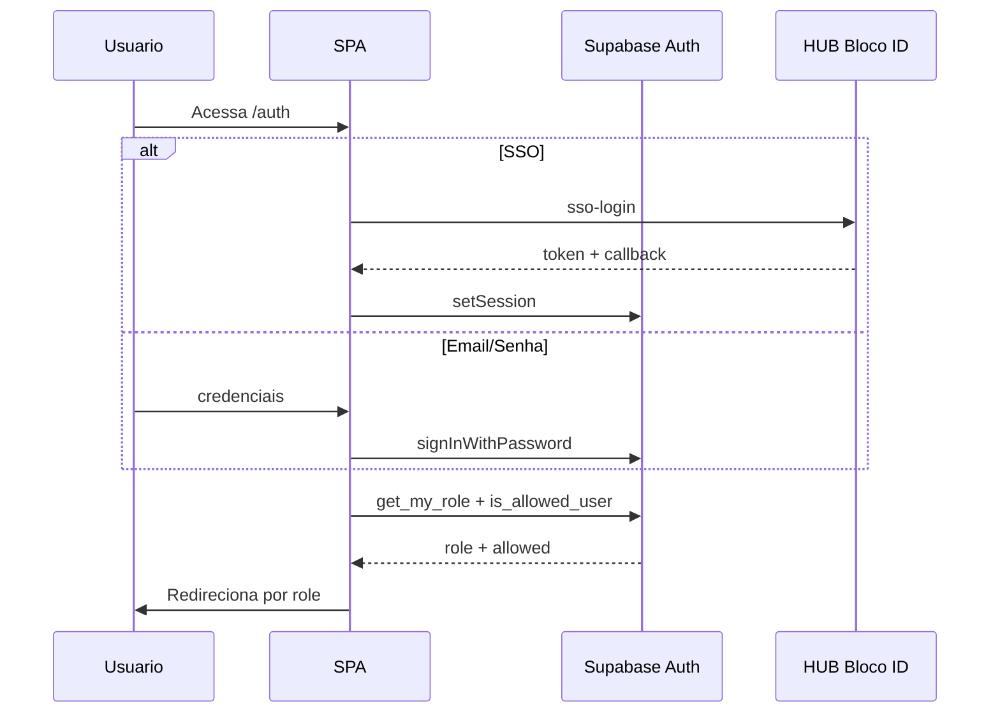
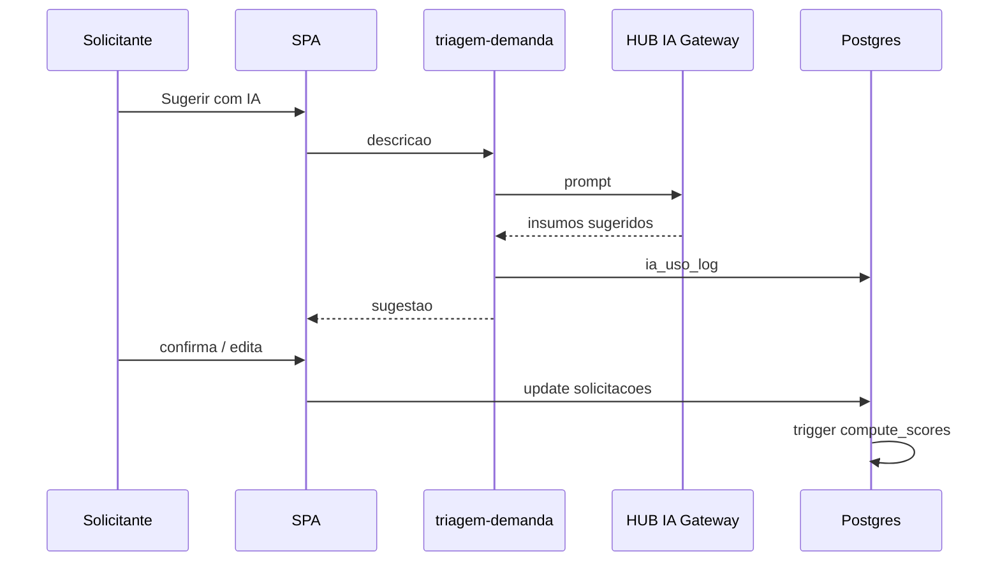
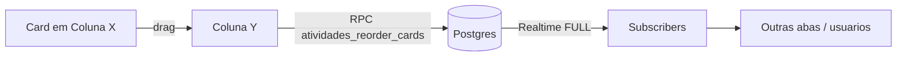
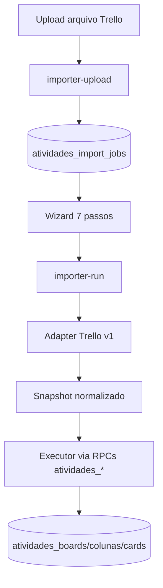
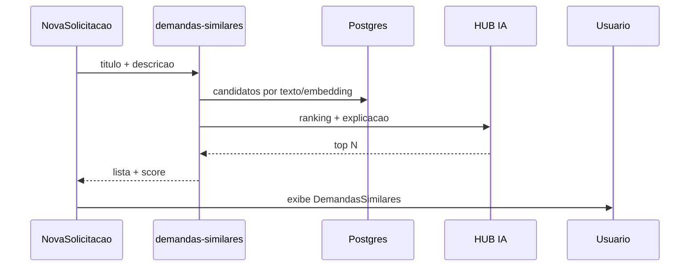

# Fluxos

## Índice
- [Login](#login)
- [Nova Solicitação com triagem IA](#nova-solicitação-com-triagem-ia)
- [Movimento de card no Kanban](#movimento-de-card-no-kanban)
- [Importador Trello](#importador-trello)
- [Detecção de similares](#detecção-de-similares)

## Login

## Nova Solicitação com triagem IA

## Movimento de card no Kanban

## Importador Trello

## Detecção de similares

