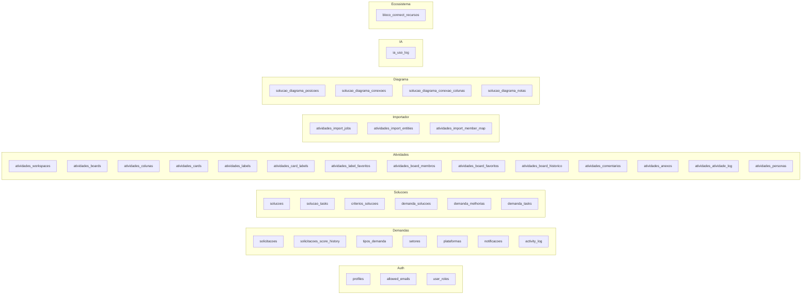

# Banco de Dados

## Índice
- [Convenções](#convenções)
- [Grupos lógicos](#grupos-lógicos)
- [Tabelas](#tabelas)
- [Enums](#enums)
- [Constraints e políticas](#constraints-e-políticas)

## Convenções
- Schema `public` (RLS habilitada por default).
- Chaves primárias `id uuid default gen_random_uuid()`.
- Auditoria: `created_at`, `updated_at` com trigger `update_updated_at_column` / `update_data_atualizacao`.
- Nomenclatura em pt-BR quando é jargão do negócio; inglês para colunas técnicas (`ordem`, `role`, `visibilidade`).
- **RLS obrigatória**; policies referem-se a `auth.uid()` + `has_role()` + `is_allowed_user()`.
- **Nunca** FK para `auth.users`; usar `profiles.id` como espelho.

## Grupos lógicos

## Tabelas

| Tabela | Papel |
| --- | --- |
| `profiles` | Espelho editável de `auth.users` (nome, email, avatar_url). |
| `allowed_emails` | Whitelist de acesso + role base. |
| `user_roles` | Papéis efetivos (`admin`) usados por `has_role`. |
| `activity_log` | Auditoria transversal. |
| `solicitacoes` | Demandas dos solicitantes; score calculado por trigger. |
| `solicitacoes_score_history` | Histórico de alterações de complexidade dev. |
| `tipos_demanda`, `setores`, `plataformas` | Cadastros auxiliares. |
| `notificacoes` | Notificações in-app. |
| `solucoes` | Catálogo de soluções entregues. |
| `solucao_tasks`, `criterios_solucoes` | Detalhamento de solução. |
| `demanda_solucoes`, `demanda_melhorias`, `demanda_tasks` | Ligações demanda ↔ solução. |
| `atividades_workspaces` | Workspaces (default `grupo-bloco`). |
| `atividades_boards` | Quadros. |
| `atividades_colunas` | Colunas do board (com `wip_limit`). |
| `atividades_cards` | Cards (título, prazo, cover, concluído). |
| `atividades_labels`, `atividades_card_labels`, `atividades_label_favoritos` | Etiquetas. |
| `atividades_board_membros` | Membros e papéis por board. |
| `atividades_board_favoritos` | Favoritos por usuário. |
| `atividades_board_historico` | Histórico agregado do board. |
| `atividades_comentarios` | Comentários por card. |
| `atividades_anexos` | Anexos por card (validação por trigger). |
| `atividades_atividade_log` | Log detalhado de mudanças. |
| `atividades_personas` | Personas ligadas a cards. |
| `atividades_import_jobs` | Jobs do importador (máquina de estado). |
| `atividades_import_entities` | Mapeamento external_id ↔ local_id. |
| `atividades_import_member_map` | Estratégia de mapeamento de membros. |
| `solucao_diagrama_posicoes/conexoes/conexao_colunas/notas` | Layout e conexões do Diagrama. |
| `ia_uso_log` | Telemetria de IA. |
| `bloco_connect_recursos` | Cache de recursos do HUB. |

## Enums
- `app_role` — inclui `admin` (usado por `user_roles` e `has_role`).
- `atividades_board_role` — `owner | admin | member | viewer`.
- Enums de status em `solicitacoes` e `atividades_import_jobs` definidos em migrations.

## Constraints e políticas
- **Unicidade**: `user_roles(user_id, role)`, `atividades_board_membros(board_id, user_id)`, `atividades_import_entities(source, entity_type, external_id, job_id)`.
- **FKs restritivas** entre board → colunas/cards/labels/anexos (delete controlado pela RPC `atividades_board_delete`).
- **Guards** (triggers) preferidos a CHECK constraints para lógica temporal.
- Detalhamento de policies por tabela vive em `docs/RLS_AUDIT.md` e no schema (39 tabelas × N policies).

## Helpdesk × Projetos: dois contextos, dois arquivados

São dois modelos de trabalho distintos e **não compartilham tabela nem estado de arquivamento**:

| | Helpdesk (Inbox) | Projetos (Quadros) |
| --- | --- | --- |
| Tabela de itens | `demands` | `atividades_cards` |
| Etapas | enum `demand_status` (fixo) | `atividades_colunas` (por quadro) |
| Encerrar item | `status = 'concluido'`, `deleted_at` para descarte | `concluido = true` |
| Arquivar contêiner | não existe (a Inbox é única) | `atividades_boards.arquivado` |
| Hook de leitura | `useDemands` | `useAtividadesBoard` |

Consequências práticas:

- Arquivar um quadro (`atividades_board_set_arquivado`) **não** afeta nenhuma linha
  de `demands`. O filtro "Arquivados" da lista de projetos lê apenas
  `atividades_boards.arquivado`.
- Encerrar/descartar uma demanda de helpdesk **não** afeta cards de quadro.
- Não há FK entre os dois mundos: `demands` não tem `board_id`/`projeto_id`. A
  ligação, quando existir, será uma decisão explícita de produto — hoje a
  separação é estrutural e intencional.
- A tradução para a linguagem de produto ("projeto" = quadro) mora em
  `src/modules/demand-access/useProjetos.ts` e `useCriarProjeto.ts`; nenhuma tela
  conhece o nome da tabela.

### Colunas padrão de um novo quadro

`atividades_create_board` cria o quadro, o membro `owner`, o registro de
histórico e exatamente **três** colunas — `A Fazer`, `Em Andamento`,
`Concluído` — na mesma transação. Antes de 2026-07-30 eram cinco (com `Backlog`
e `Em Revisão`); quadros criados antes disso mantêm as colunas originais.

