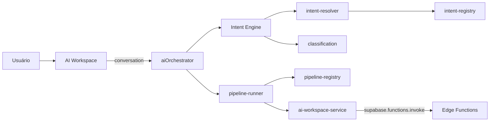

# 22 · AI Intent Engine

> Camada arquitetural (Task 004) que decide **qual pipeline usar** antes de disparar qualquer serviço de IA. Nenhuma edge function, tabela ou migration foi criada — apenas orquestração no cliente.

## Objetivo
Desacoplar o AI Workspace dos serviços concretos (`assistente-demanda`, `triagem-demanda`, `demandas-similares`, `match-ecossistema`). O Workspace passa a conversar exclusivamente com o `aiOrchestrator`.

```
Usuário → AI Workspace → Orchestrator → Intent Engine → Pipeline Runner → Serviços existentes
```

## Estrutura de pastas
```
src/modules/ai/
├── intent/
│   ├── intent-engine.ts        # classifyConversation()
│   ├── intent-registry.ts      # 9 intents oficiais
│   ├── intent-resolver.ts      # heurística determinística (keywords + regex)
│   └── intent-types.ts
├── pipelines/
│   ├── pipeline-registry.ts    # mapa intent → serviço destino
│   ├── pipeline-runner.ts      # forwarding puro
│   └── pipeline-types.ts
├── services/
│   ├── ai-orchestrator.ts      # fachada única do Workspace
│   └── ai-workspace-service.ts # I/O com edge functions (isolado)
├── types/
│   ├── classification.ts
│   └── conversation.ts
├── __tests__/
│   └── intent-engine.test.ts
└── index.ts
```

## Intents oficiais
| ID | Pipeline | Cria ticket | Responde imediato |
|----|----------|:-:|:-:|
| BUG | bug (triagem-demanda) | ✅ | – |
| INCIDENT | incident (triagem-demanda) | ✅ | – |
| FEATURE_REQUEST | feature (assistente-demanda) | ✅ | – |
| IMPROVEMENT | improvement (assistente-demanda) | ✅ | – |
| AUTOMATION | automation (assistente-demanda) | ✅ | – |
| QUESTION | question (assistente-demanda) | – | ✅ |
| KNOWLEDGE | knowledge (assistente-demanda) | – | ✅ |
| SUPPORT | support (assistente-demanda) | ✅ | – |
| UNKNOWN | unknown (assistente-demanda) | ✅ | – |

## Objeto de classificação
```ts
{
  intent: "BUG",
  confidence: 0.86,
  pipeline: "bug",
  shouldCreateTicket: true,
  shouldAskQuestion: true,
  shouldSearchKnowledge: false,
  shouldRespondImmediately: false,
  suggestedPriority: "Alta",
  suggestedCategory: "Erro",
  suggestedSystem: null,
  matchedKeywords: ["não funciona", "erro"]
}
```

## Diagrama


## Exemplos de classificação
| Frase | Intent |
|-------|--------|
| "O botão salvar não funciona." | BUG |
| "Gostaria de exportar em PDF." | FEATURE_REQUEST |
| "Como cadastrar um colaborador?" | QUESTION |
| "Quero automatizar a admissão." | AUTOMATION |
| "O sistema está fora do ar." | INCIDENT |
| "Existe alguma documentação sobre férias?" | KNOWLEDGE |
| "Gostaria de melhorar o dashboard." | IMPROVEMENT |
| "Não consigo acessar." | SUPPORT |
| texto sem sinal | UNKNOWN |

## Responsabilidades
- **Intent Engine** — pura, sem I/O. Recebe conversation, devolve `IntentClassification`.
- **Pipeline Runner** — encaminhamento; zero regra de negócio.
- **Orchestrator** — fachada do Workspace: `decide()`, `runTurn()`, `finalize()`, `matchEcossistema()`.
- **ai-workspace-service** — único ponto que fala com Supabase Edge Functions.
- **AI Workspace (hook)** — só importa `@/modules/ai`. Não conhece `supabase.functions.invoke`.

## Testes
`src/modules/ai/__tests__/intent-engine.test.ts` cobre:
- Integridade do registry (todo intent aponta para pipeline existente).
- Resolver acerta as 8 frases-âncora e cai em UNKNOWN quando não há sinal.
- Pipeline Runner encaminha BUG → bug e QUESTION → handler `immediate-answer`.
- Orchestrator combina classificação + pipeline em uma única chamada e propaga `suggestedSystem`.

## Roadmap futuro
- **Classificador LLM**: substituir o resolver heurístico por chamada dedicada ao HUB (ainda mantendo o mesmo contrato `IntentClassification`).
- **Handlers por pipeline**: separar `bug-pipeline.ts`, `question-pipeline.ts` etc. para lógicas específicas (RAG em KNOWLEDGE, on-call em INCIDENT).
- **Telemetria**: gravar `ia_uso_log` com `intent` + `confidence` para observabilidade de acertos.
- **Multi-turno inteligente**: usar `matchedKeywords` para pular perguntas já respondidas.

## Restrições respeitadas (Task 004)
❌ Nenhuma edge function nova · ❌ Nenhuma tabela/migration · ❌ Nenhum ajuste em RLS/Storage/Auth · ❌ Nenhuma mudança em Kanban/Dashboard/Sidebar/Header/Design System.
