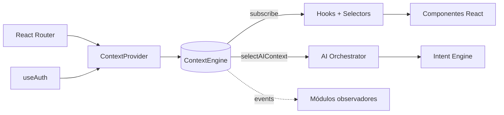

# 23 — Context Engine (Workspace Context)

Camada **framework-agnóstica** que dá consciência de contexto para toda a plataforma. Informa automaticamente à IA (e a outros módulos) **onde o usuário está** e **o que está fazendo**, sem precisar deduzir da conversa.

> Escopo desta Task: apenas **em memória** (sessão da aplicação). Sem banco, sem edge functions, sem persistência.

## Arquitetura

```
src/modules/context/
├── context-types.ts        # WorkspaceContext, EventMap, tipos
├── context-events.ts       # pub/sub tipado (sem deps externas)
├── context-builder.ts      # buildFromRoute, buildCardContext, ...
├── context-engine.ts       # store singleton (get / patch / subscribe / events)
├── context-selectors.ts    # selectors puros
├── context-provider.tsx    # ponte React ↔ engine (router + auth)
├── context-hooks.ts        # useWorkspaceContext, useCurrentModule, ...
└── __tests__/context-engine.test.ts
```

### Diagrama



## Objeto `WorkspaceContext`

```ts
{
  workspace: "engineering",
  module: "atividades",
  page: "board-1",
  route: "/atividades/board-1",
  entityType: "board",
  entityId: "board-1",
  selectedItems: [],
  organizationId: null,
  currentUser: { id, role },
  breadcrumbs: [],
  filters: {},
  metadata: {},
  updatedAt: 1737400000000
}
```

## Eventos

| Evento              | Payload                                          |
| ------------------- | ------------------------------------------------ |
| `MODULE_CHANGED`    | `{ previous, current }`                          |
| `ROUTE_CHANGED`     | `{ previous, current }`                          |
| `ENTITY_SELECTED`   | `{ entityType, entityId }`                       |
| `CARD_SELECTED`     | `{ cardId }`                                     |
| `SPRINT_SELECTED`   | `{ sprintId }`                                   |
| `FILTER_CHANGED`    | `{ key, value }`                                 |
| `CONTEXT_CHANGED`   | `{ context }` (após qualquer mutação)            |

## Hooks

```ts
useWorkspaceContext()      // objeto completo
useAIWorkspaceSnapshot()   // snapshot compacto p/ o Orchestrator
useCurrentModule()         // ModuleKey
useSelectedEntity()        // { type, id }
useBreadcrumbs()           // BreadcrumbItem[]
useContextActions()        // { patch, selectCard, selectSprint, setFilter, ... }
```

Todos os hooks usam `useSyncExternalStore` + selectors, evitando re-renderizações desnecessárias.

## Integração com o AI Orchestrator

O Orchestrator **não conhece React**. O contexto é injetado por parâmetro:

```ts
aiOrchestrator.decide(conversation, { workspaceContext });
aiOrchestrator.runTurn(conversation, { workspaceContext });
aiOrchestrator.finalize({ conversation, sistemas, workspaceContext });
```

O hook `useAIWorkspace` chama `useAIWorkspaceSnapshot()` e repassa. Assim:

- Componentes React **não** falam com Edge Functions.
- Orchestrator **não** importa nada de React ou do módulo `context`.
- Injeção de dependência estrutural (`OrchestratorContext` é uma interface local).

## Exemplos

```ts
// Selecionar um card no Kanban
const { selectCard } = useContextActions();
selectCard(card.id);

// Registrar filtro
const { setFilter } = useContextActions();
setFilter("status", "aberto");

// Escutar eventos em qualquer módulo
useEffect(() => {
  const off = engine.events.on("MODULE_CHANGED", ({ current }) => {
    console.log("agora em", current);
  });
  return off;
}, []);
```

## Roadmap futuro

- **Persistência opcional** por usuário (`filters`, últimos entities visitados).
- **Middlewares de eventos** (analytics, telemetria IA).
- **Context propagation** para edge functions via header `X-Workspace-Context`.
- **Contexto multi-tenant** (`organizationId` alimentado pelo HUB).

## Restrições

- Nunca importar `context-provider.tsx` fora do módulo `context`.
- Nunca importar React em arquivos de domínio (`engine`, `builder`, `events`, `selectors`, `types`).
- Mutações devem passar pelo engine — nunca reatribuir `state` externamente.
