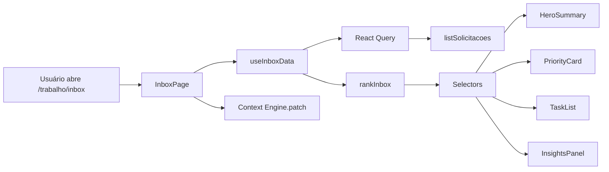

# Intelligent Inbox — Centro de Trabalho

Data: 2026-07-21
Status: Ativo (Task 006)

## Objetivo

Nova experiência de abertura diária do sistema. Responde imediatamente:

- O que preciso fazer agora?
- O que está atrasado?
- O que venceu hoje?
- O que exige minha atenção?
- Quais são minhas próximas tarefas?

Não substitui o Dashboard — coexiste com ele. É o ponto de entrada para quem trabalha diariamente no gestor de automações.

## Arquitetura

Módulo isolado em `src/modules/inbox/`:

```
inbox/
├── components/        # UI (10 componentes memoizados)
├── hooks/             # useInboxData (React Query + rank)
├── services/          # priority-engine
├── selectors/         # summary, insights, my-tasks, priority
├── types/             # InboxItem, RankedInboxItem, Insight...
├── utils/             # format (formatDaysAgo, greeting)
└── __tests__/         # priority-engine, selectors
```

Rota: `/trabalho/inbox` (registrada em `src/App.tsx`, protegida por `ProtectedRoute`).

Navegação: item "Inbox" adicionado no topo das três sidebars (dev, requester, builder) em `src/components/AppLayout.tsx`. Dashboard preservado.

## Fluxos



Ao montar, `InboxPage` chama `contextEngine.patch({ workspace: "engineering", module: "inbox", page: "home", route: "/trabalho/inbox" })` — o Orchestrator passa a saber automaticamente que o usuário está na Inbox.

## Priority Engine

Serviço puro `services/priority-engine.ts`. Rankeia itens (0–1000 pts) a partir de:

| Fator             | Peso máx | Notas                                              |
| ----------------- | -------- | -------------------------------------------------- |
| Prioridade (0–100)| 400      | `priority × 4`                                     |
| Status            | ~65      | `desenvolvimento`, `aprovacao` valem mais         |
| Tempo parado      | 200      | `min(200, dias × 15)`                              |
| SLA               | 250      | vencido = 250; ≤2d = 150; ≤5d = 60                 |
| Responsável = eu  | 60       | bônus se `responsibleId === currentUserId`         |

Itens `entregue`/`cancelado` são capados em 30 pts (vão para o fim da lista).

`futureRecommendations()` reservado para integração com IA em Task futura — hoje retorna `null`.

## Componentes

| Componente        | Papel                                                     |
| ----------------- | --------------------------------------------------------- |
| `InboxPage`       | Orquestra layout, chama Context Engine                    |
| `HeroSummary`     | Saudação + 4 chips (Críticos/Andamento/QA/Concluídos)     |
| `PriorityCard`    | Card destaque "Prioridade agora" com botão Continuar      |
| `TaskList`        | Lista virtualizável (grid 2/3)                            |
| `TaskCard`        | Item da lista                                             |
| `RecentActivity`  | Últimas 6 movimentações do usuário                        |
| `QuickActions`    | Atalhos (Nova Solicitação, AI Workspace, Kanban, ...)     |
| `InsightsPanel`   | Insights locais (sem IA nesta Task)                       |
| `EmptyInbox`      | Estado vazio                                              |
| `LoadingInbox`    | Estado de carregamento                                    |

Todos memoizados. Acessibilidade: `role`, `aria-label`, focus-visible rings, contraste via tokens semânticos.

## Critérios de priorização

O item mostrado como **Prioridade agora** é o primeiro `RankedInboxItem` cujo status não é `entregue`/`cancelado`. Se dois itens têm o mesmo score, a ordem original preserva a estabilidade do sort.

## Restrições respeitadas

- ❌ Sem migrations, tabelas, edge functions ou alterações de RLS.
- ❌ Sem alteração em Dashboard, AI Workspace, Intent Engine ou Context Engine (apenas nova `ModuleKey = "inbox"` aditiva).
- ❌ Sem alteração de autenticação.
- ✔ Sidebar apenas ganhou 1 item novo.

## Roadmap

- Integrar `useAtividadesBoard` para trazer cards do Kanban à Inbox.
- Substituir `RecentActivity` heurístico por `audit_log` real quando disponível.
- Ativar `futureRecommendations()` chamando o AI Orchestrator com `WorkspaceContext` para sugerir a próxima ação.
- Virtualização (`@tanstack/react-virtual`) quando `myTasks.length > 100`.
