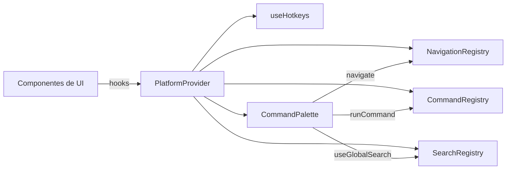

# Platform Productivity Layer

Camada global de produtividade que fornece navegação desacoplada, pesquisa unificada, comandos globais, hotkeys e Command Palette. Todos os módulos de domínio consomem esta camada — nenhum conhece rotas literais ou atalhos por conta própria.

## Índice
- [Objetivo](#objetivo)
- [Arquitetura](#arquitetura)
- [Registries](#registries)
- [Provider e Hooks](#provider-e-hooks)
- [Command Palette](#command-palette)
- [Global Search e Ranking](#global-search-e-ranking)
- [Hotkeys](#hotkeys)
- [Pontos de extensão](#pontos-de-extensão)
- [Restrições](#restrições)

## Objetivo
Fornecer uma superfície única para: (a) descoberta de comandos, (b) navegação por id lógico, (c) pesquisa unificada e (d) atalhos globais. A camada é 100% frontend, em memória, sem banco, sem edge functions e sem IA nesta fase.

## Arquitetura



Estrutura:

```
src/modules/platform/
├── types/              # contratos públicos
├── registry/           # navigation, search, command + defaults
├── providers/          # PlatformProvider (React)
├── hooks/              # usePlatform, useCommandPalette, useNavigation, useGlobalSearch, useCommands
├── hotkeys/            # useHotkeys (event bus de teclado)
├── components/         # CommandPalette
├── utils/              # ranking, parsing/formatting de hotkeys
└── __tests__/
```

## Registries

### NavigationRegistry
Registro central de rotas lógicas. O restante do app nunca conhece a string da rota — sempre resolve por `id`.

```ts
navigationRegistry.register({
  id: "kanban",
  title: "Kanban",
  route: "/atividades",
  category: "Trabalho",
  keywords: ["board", "sprint", "cards"],
  icon: KanbanIcon,
  permissions: ["developer", "administrador"],
});

const route = navigationRegistry.routeOf("kanban"); // fonte única
```

### SearchRegistry
Aceita entidades estáticas e providers dinâmicos por tipo (`solicitacao`, `solucao`, `atividade`, `usuario`, `sprint`, `projeto`, `artigo`, `automacao`, `nav`). Erros em providers são silenciosos por design.

```ts
searchRegistry.registerProvider("solicitacao", async () =>
  cache.list().map((s) => ({ id: s.id, type: "solicitacao", label: s.titulo, route: `/solicitacao/${s.id}` }))
);
```

### CommandRegistry
Comandos globais executáveis com contexto injetado (`navigate`, `openPalette`, `closePalette`).

```ts
commandRegistry.register({
  id: "cmd.open-inbox",
  title: "Abrir Inbox",
  shortcut: "mod+shift+i",
  category: "Navegar",
  handler: ({ navigate, closePalette }) => { navigate("/trabalho/inbox"); closePalette(); },
});
```

## Provider e Hooks

`PlatformProvider` monta a Command Palette, registra defaults uma única vez (idempotente) e escuta o hotkey global `⌘K` / `Ctrl+K`. Deve ficar sob `<AuthProvider>` e `<ContextProvider>` — foi montado em `src/App.tsx`.

Hooks públicos:
- `usePlatform()` — acesso ao contexto completo.
- `useCommandPalette()` — `open`, `openPalette`, `closePalette`, `togglePalette`.
- `useNavigation()` — `items`, `goto(id)`, `routeOf(id)`, `navigate(route)`.
- `useGlobalSearch(debounceMs?)` — `query`, `setQuery`, `results`, `loading`.
- `useCommands()` — `commands`, `run(id)` filtrados por role.
- `useHotkeys(bindings)` — bindings ad-hoc por página.

## Command Palette
- Ativação: `⌘K` (mac) / `Ctrl+K` (demais). `Esc` fecha. Setas navegam. `Enter` executa.
- Modal central em desktop; ocupa a tela inteira em mobile (herdado do `DialogContent` do design system).
- Resultados agrupados por categoria: Recentes → Páginas (search) → Categorias de comandos.
- Cada item mostra ícone, título, descrição opcional e badge de atalho.
- Foco automático no input ao abrir; `Focus Trap` e ARIA fornecidos por Radix Dialog + cmdk.

## Global Search e Ranking

Nesta fase o `useGlobalSearch` opera sobre `SearchRegistry.collect()` — apenas dados já carregados no cliente e providers síncronos/assíncronos leves. Não há chamada de rede específica de busca.

Pontuação heurística em `utils/ranking.ts`:

| Sinal              | Peso padrão |
| ------------------ | ----------: |
| Título exato       |         100 |
| Prefixo de título  |          60 |
| Parcial de título  |          30 |
| Keyword            |          25 |
| Categoria          |          15 |
| Descrição          |          10 |
| Recência           |    20 × fator |

A normalização é `lowercase` + remoção de diacríticos. Pesos são injetáveis via `RankOptions.weights`.

## Hotkeys
Formato: `mod+k`, `mod+shift+n`, `esc`. `mod` = `Meta` em macOS, `Ctrl` no restante. `useHotkeys` ignora eventos em campos editáveis (exceto `Esc`) e respeita `defaultPrevented`.

## Pontos de extensão

Preparado, mas NÃO implementado nesta task:
- **IA / linguagem natural**: adicionar um `CommandProvider` que consulta o `aiOrchestrator` (`src/modules/ai`) e devolve comandos sugeridos a partir do texto livre da palette.
- **Busca semântica (RAG)**: registrar um provider extra em `SearchRegistry` que consulta uma edge function de embeddings — a interface `SearchProvider` já é assíncrona.
- **Busca no Supabase**: providers por entidade (`solicitacao`, `atividade`, `usuario`) apontando para RPCs/tabelas existentes.
- **Telemetria**: `markRecent` já persiste um histórico local que pode ser espelhado em `ia_uso_log` ou tabela dedicada.
- **Sinais do Context Engine**: o `PlatformProvider` já lê o `role` do `useAuth`; um próximo passo é consumir `useCurrentModule()` para reordenar resultados por contexto.

## Restrições
- Sem banco, migrations, edge functions, IA ou alterações em módulos existentes.
- Nenhum módulo de domínio deve importar de `registry/defaults.ts` — apenas dos hooks/registries.
- Rotas literais espalhadas pelo código devem migrar para `navigationRegistry.routeOf(id)`; esta task não faz o retrofit — introduz apenas a camada.
