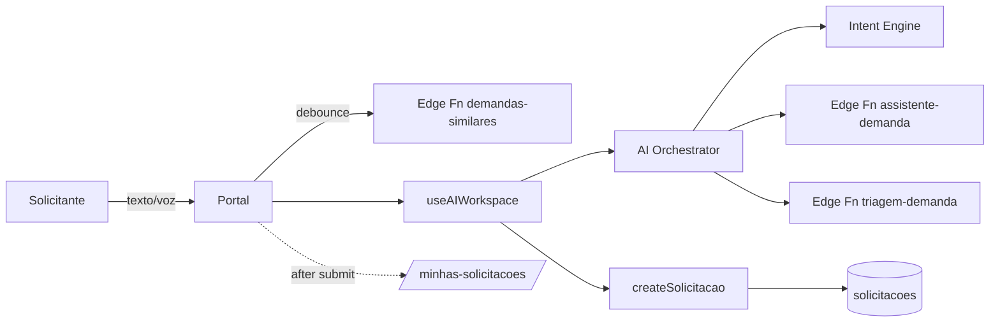

# 27 — Portal do Solicitante

Ponto de entrada humano da plataforma para usuários **não técnicos**
(RH, Financeiro, Comercial, colaboradores em geral).

Rota: **`/portal`**

## Princípio de projeto

- Uma única pergunta na tela: **"Como podemos ajudar você hoje?"**.
- Nenhum jargão técnico (sem sprint/kanban/task/bug/backlog/SLA).
- A IA conduz. O usuário apenas descreve o problema.
- Sugestões surgem **sem interromper** enquanto ele digita.

## Arquitetura — 100% reuso

### Reutilizado (nenhum recurso novo de backend)

| Camada | Recurso |
|---|---|
| Componentes | `ChatContainer`, `ConversationInput`, `ConversationFooter`, `PreviewPanel`, `StatusTimeline` |
| Hooks | `useAIWorkspace`, `useAuth`, `useToast` |
| Serviços | `aiOrchestrator`, `createSolicitacao`, `salvarMatchEcossistema` |
| Contexto | `Context Engine` (via `useAIWorkspace` → `useAIWorkspaceSnapshot`) |
| Edge Functions | `assistente-demanda`, `triagem-demanda`, `demandas-similares`, `match-ecossistema` |
| RPC / Tabelas | `solicitacoes` (nenhuma tabela nova) |
| Notificações | `notificacoes` (fluxo já disparado por `createSolicitacao`) |

### Novos artefatos (mínimo indispensável)

| Arquivo | Motivo |
|---|---|
| `src/pages/Portal.tsx` | Casca "conversacional-primeiro" com linguagem leiga. |
| `src/components/portal/LiveSuggestions.tsx` | Sugestões em tempo real (debounce 700 ms) chamando a Edge Function `demandas-similares` já existente. |
| Rota `/portal` em `src/App.tsx` | Nova entrada. |
| Item "Portal" no menu do solicitante | Descobribilidade. |

Nenhum banco, migration, RPC, trigger, view, bucket ou Edge Function novos.

## Fluxo

1. Usuário abre `/portal`.
2. Digita ou fala (Web Speech API — fallback silencioso).
3. Enquanto digita, `LiveSuggestions` mostra até 3 solicitações parecidas.
4. Ao enviar, entra na conversa conduzida pela IA (`useAIWorkspace`).
5. IA pergunta o mínimo necessário, gera resumo, categoria, prioridade e sistema.
6. Usuário revisa em `PreviewPanel` e confirma.
7. Redireciona para `/minhas-solicitacoes` (timeline visual reaproveita `StatusTimeline`).

## Acessibilidade

- Foco automático no campo principal.
- `aria-label`/`aria-pressed` nos controles de voz e envio.
- Contraste WCAG AA (tokens do design system).
- Navegação por teclado (Enter envia, Shift+Enter quebra linha).

## Anexos

Nesta primeira entrega o botão de anexo apenas orienta o usuário a
adicionar arquivos na tela da solicitação (bucket existente
`atividades_anexos` / mecanismo de anexos das solicitações). Ampliar para
upload direto pré-criação é próximo passo — requer decisão sobre bucket
temporário e limpeza por TTL.

## Realtime

Timeline pós-criação usa as páginas existentes (`/minhas-solicitacoes`,
`/solicitacao/:id`) que já consomem `StatusTimeline`. Realtime das
solicitações não é ativado por este módulo — segue o comportamento atual.

## Segurança

- RLS de `solicitacoes` já cobre criação/leitura por solicitante.
- Rate-limit da IA aplicado nas Edge Functions reutilizadas (Onda 0).
- Sanitização de entrada delegada ao `PreviewPanel` (fluxo já validado).

## Próximos passos recomendados

1. Upload real de anexos antes da criação (bucket temporário + move ao criar).
2. Ativar Realtime na timeline da solicitação para atualização sem refresh.
3. Base de conhecimento (FAQ) alimentando `LiveSuggestions` além de solicitações.
4. Definir `/portal` como landing pós-login para role `requester`.
