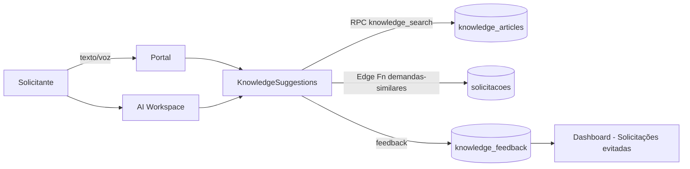
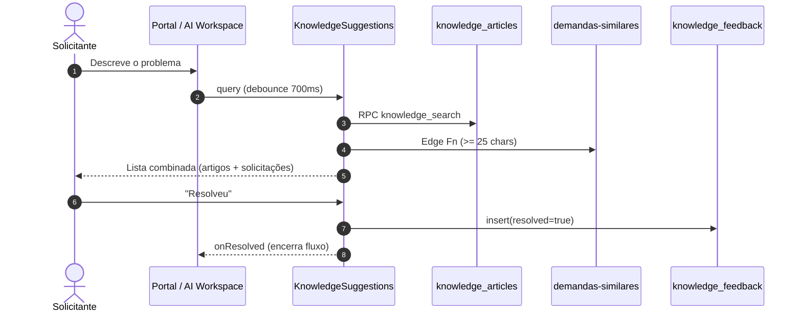

# 28 — Central Inteligente de Soluções

Camada que **evita solicitações desnecessárias**. Enquanto o usuário
descreve seu problema (no Portal ou no AI Workspace), o sistema busca
conteúdos que podem resolver a necessidade **antes** de virar uma
solicitação.

## Princípio

A pergunta não é "como abrir mais chamados", é
**"como resolver o problema sem abrir chamado?"**.

## Arquitetura



## Reuso (obrigatório antes de qualquer criação)

| Camada | Recurso |
|---|---|
| Componentes | `KnowledgeSuggestions` (novo), reusa `Button`, `Card`, `Skeleton`, `Link` |
| Hooks | `useAIWorkspace`, `useAuth`, `useToast` |
| Serviços | `aiOrchestrator` (AI Workspace já roteia intents), Supabase client |
| Edge Functions | **`demandas-similares`** (já existente) para solicitações parecidas |
| RPC | **`knowledge_search`** (novo, mínima; nenhuma alternativa possível) |
| Tabelas | Nenhuma existente serve como base de conhecimento — criadas 2 novas |

## Novos recursos e justificativa

| Recurso | Motivo |
|---|---|
| Tabela `knowledge_articles` | Não existia estrutura para artigos/FAQs/procedimentos. |
| Tabela `knowledge_feedback` | Base das métricas "solicitações evitadas". |
| RPC `knowledge_search` | Full-text search em português com `websearch_to_tsquery` + `ts_rank_cd`. Chamada direto do cliente autenticado — evita mais uma edge function. |
| Trigger `knowledge_articles_refresh_tsv` | `to_tsvector('portuguese', …)` é STABLE e não pode ser usada em generated column; trigger é o padrão recomendado. |
| Módulo `src/modules/knowledge/` | Desacopla o consumo (Portal, AI Workspace, Dashboard) do backend. |

## Fluxo — usuário resolve sem abrir solicitação



Se o usuário responder "Ainda preciso de ajuda", o feedback é gravado
com `resolved=false` e a criação da solicitação segue normal.

## Modelo de dados

```sql
knowledge_articles(
  id, tipo(artigo|faq|procedimento|video|documento|link),
  titulo, resumo, conteudo, url_externa,
  categoria, sistema_slug, tags[], palavras_chave[],
  status(publicado|arquivado|rascunho),
  autor_id, autor_email, views,
  search_tsv (mantido por trigger)
)

knowledge_feedback(
  id, user_id, article_id, demanda_similar_id,
  query_text, resolved, origem(portal|ai_workspace|outro),
  metadata
)
```

## Segurança (RLS)

- `knowledge_articles`: leitura pública apenas de `publicado`; admin vê todos; escrita restrita a admin.
- `knowledge_feedback`: inserção apenas pelo próprio usuário; leitura pelo próprio usuário OU admin (para métricas).
- `knowledge_search`: `SECURITY INVOKER`, execução só para `authenticated` e `service_role`.

## Métricas

Alimentadas por `knowledge_feedback` (30d):

- Solicitações evitadas (contagem de `resolved=true`)
- Taxa de resolução (% de feedbacks positivos)
- Top artigos que mais resolveram
- Solicitações vs. evitadas (comparativo — próximo passo)

Cards ficam no Dashboard (`KnowledgeMetricsCards`). Só o admin
enxerga números agregados; solicitantes veem apenas os próprios eventos
(RLS).

## Busca

- PostgreSQL full-text em `portuguese` com pesos:
  - A = título · B = resumo + palavras-chave · C = tags · D = conteúdo
- Índice GIN em `search_tsv`.
- Ranking por `ts_rank_cd`.
- Preparado para busca semântica futura: basta acrescentar coluna
  `embedding VECTOR(768)` + índice IVFFLAT/HNSW e um segundo caminho no
  `knowledgeService.search`.

## Reutilização máxima

- **Nenhuma** edge function nova; `demandas-similares` continua sendo a
  única fonte de similaridade entre solicitações.
- **Nenhuma** alteração no AI Orchestrator, Intent Engine, Context Engine
  ou Language Provider.
- Portal apenas troca `LiveSuggestions` (v1, só demandas) por
  `KnowledgeSuggestions` (v2, artigos + demandas + feedback).

## Riscos conhecidos

- Base de conteúdo inicial pequena (5 artigos-semente). Impacto real
  depende de conteúdo cadastrado pelo time de conhecimento.
- Sem embeddings semânticos ainda — sinônimos raros podem ficar de fora.
- Feedback não confirma comportamento (o usuário pode dizer "resolveu"
  sem realmente ter resolvido). Mitigado pela taxa agregada.

## Próximos passos recomendados

1. Editor administrativo de artigos (CRUD com Markdown).
2. Busca semântica via embeddings (`google/text-embedding-004`).
3. Comparativo "abertas × evitadas" por categoria no Dashboard.
4. Integração com o campo `sistema_slug` do Ecossistema para filtrar por sistema alvo.
5. Tour guiado: o admin cria artigo diretamente a partir de uma solicitação recorrente.
