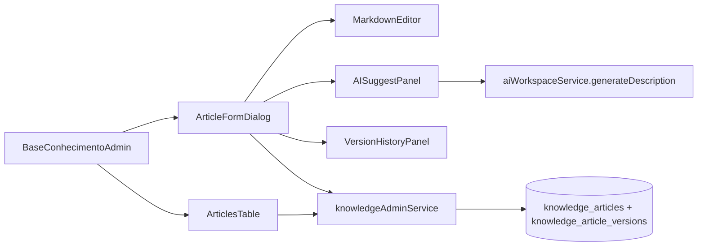
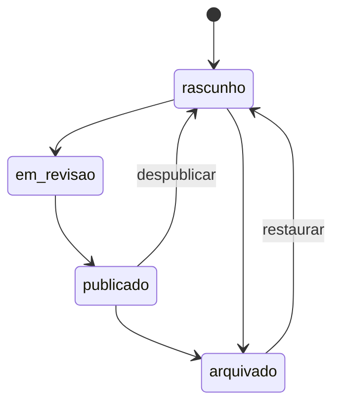

# 29. Centro Administrativo da Base de Conhecimento

## Objetivo

Permitir que administradores mantenham a Base de Conhecimento (Feature 002) sem SQL: CRUD, workflow de publicação, histórico de versões, IA sugestiva e métricas — reutilizando integralmente a arquitetura existente.

## Arquitetura

- **Módulo**: `src/modules/knowledge-admin/`
- **Página**: `src/pages/admin/BaseConhecimento.tsx` em `/admin/base-conhecimento`
- **Acesso**: apenas `isAdministrador === true` (dupla proteção: rota + página)

## Workflow

Administradores podem mover livremente entre estados. Estrutura preparada para futura etapa "aprovação por gestor" (campo `revisor_id` reservado no snapshot).

## Versionamento

Cada `INSERT` ou `UPDATE` em `knowledge_articles` dispara o trigger `trg_knowledge_articles_snapshot`, que grava uma nova linha em `knowledge_article_versions` (versão sequencial por artigo, snapshot JSONB completo, autor e resumo). O painel `VersionHistoryPanel` lista o histórico e permite restaurar qualquer versão (o restore é apenas um `UPDATE`, então gera nova versão preservando a auditoria).

## Segurança

- RLS de `knowledge_articles`: `has_role(auth.uid(), 'admin')` para insert/update/delete.
- RLS de `knowledge_article_versions`: leitura e escrita apenas para admin.
- Soft delete via `deleted_at` — `knowledge_search()` ignora deletados.
- Markdown renderizado com `react-markdown` + `rehype-sanitize` (proteção XSS). Nunca salvamos HTML.

## Recursos reutilizados

- Tabelas: `knowledge_articles`, `knowledge_feedback`, `user_roles`.
- Funções DB: `has_role`, `knowledge_search`.
- Serviços/hooks: `useAuth`, `aiWorkspaceService`, React Query, `useToast`.
- UI: shadcn Table/Dialog/Tabs/Select/DropdownMenu/Textarea, `EmptyState`.

## Recursos criados

Frontend:
- `services/admin-service.ts`, `hooks/*`, `components/*`, `types/*`, `utils/markdown.tsx`
- Página `pages/admin/BaseConhecimento.tsx`
- Rota `/admin/base-conhecimento` (só admin)
- Item de menu "Base de Conhecimento" na sidebar (só admin)

Backend (1 migração aditiva):
- Coluna `knowledge_articles.deleted_at`
- Tabela `knowledge_article_versions`
- Trigger `trg_knowledge_articles_snapshot`
- `knowledge_search()` atualizada para ignorar deletados

## IA

`AISuggestPanel` reusa `aiWorkspaceService.generateDescription`, enviando um prompt sintético (melhorar/resumir/expandir/FAQ/tags/título). O admin sempre revisa antes de aplicar. Nenhuma nova edge function.

## Roadmap

1. Aprovação formal por gestor antes de `em_revisao → publicado`.
2. Editor rich (WYSIWYG) opcional.
3. Embeddings semânticos para busca (`text-embedding-004`).
4. Dashboards: artigos mais/menos acessados, taxa de resolução por artigo, autores mais ativos.
5. Comentários internos em rascunhos.
