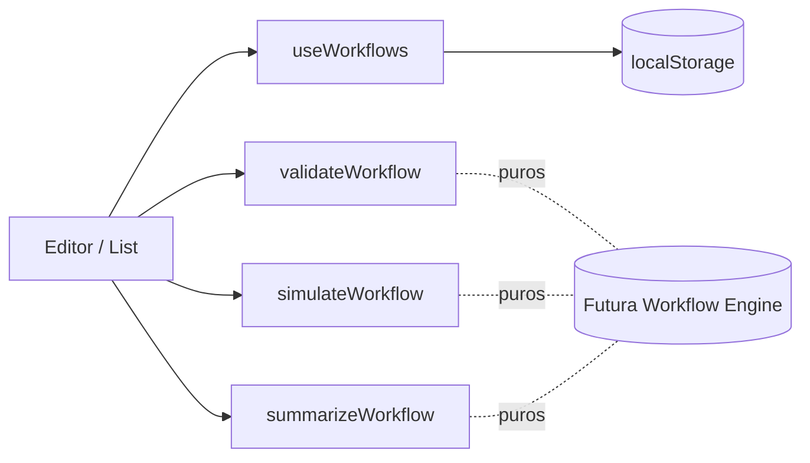

# Workflow Builder — Editor Visual

**Status:** Feature 006A · Produção · 2026-07-22
**Escopo:** Apenas construção visual + simulação. **Não executa** workflows, não há engine, banco ou edge functions.

---

## 1. Objetivo

Permitir que administradores criem regras "Quando X, se Y, então Z" sem código.
A UI foi projetada para receber a futura Workflow Engine sem refactor.

## 2. Arquitetura

```text
src/modules/workflow-builder/
  types/          modelo (WorkflowDefinition, Condition, Action, ...)
  utils/          catalog · summary · simulator · id
  validators/     validateWorkflow / isValid
  hooks/          useWorkflows (localStorage store + versionamento local)
  components/     WorkflowList · WorkflowEditor · ConditionBuilder
                  ActionBuilder · WorkflowSimulator · WorkflowsOpsCard
  __tests__/      summary · validator · simulator
```

Todos os utilitários são **puros** — sem React, sem Supabase. Isso permite reaproveitá-los diretamente na Engine.



## 3. Modelo

```ts
WorkflowDefinition {
  id, name, description, enabled, category, priority, notes,
  trigger,                 // demand.created | ... | manual
  conditions: ConditionGroup,   // AST recursivo AND/OR/NOT
  actions: WorkflowAction[],    // ordenadas
  version, author, created_at, updated_at
}
```

`ConditionGroup` é recursivo — grupos aninhados suportam combinações arbitrárias.
`priority` é apenas metadado (usado depois pela Engine).

## 4. UX (Human First)

- Etapas numeradas: **Informações → Quando → Condições → Ações → Resumo → Simulação**.
- Linguagem em português, sem termos técnicos: "Todas (E)", "Qualquer (OU)", "Nenhuma (NÃO)".
- Resumo automático gerado por `summarizeWorkflow`.
- Simulação não executa nada — mensagem explícita.

## 5. Persistência

`useWorkflows` grava em `localStorage` (`workflow-builder:drafts:v1`).
Versão incrementa a cada `update`; duplicar cria cópia com `version = 1` e `enabled = false`.

Trocar essa camada por Supabase no futuro exige apenas alterar `hooks/useWorkflows.ts` — a UI não muda.

## 6. Preparação para a Engine

- `simulator.ts` já usa a mesma AST que a Engine consumirá.
- `validators/workflow.ts` também.
- Adicionar `engine/` no mesmo módulo, reusando `types/` e `utils/simulator.ts`, é a próxima etapa.

## 7. Integrações

| Onde                  | Componente             | Observação                                          |
| --------------------- | ---------------------- | --------------------------------------------------- |
| `/admin/workflows`    | `WorkflowList`         | Lista com duplicar / editar / excluir.              |
| `/admin/workflows/novo` e `/:id` | `WorkflowEditor` | Editor + simulação.                       |
| `/operacoes`          | `WorkflowsOpsCard`     | Card leve — apenas quantidade cadastrada.           |

Nenhuma alteração em AI Workspace, Intent Engine, Context Engine, Platform Layer, Human First UX, Portal, Knowledge, Inbox, Smart Routing ou Operations além do card informativo.

## 8. Reuso

- `Card`, `Button`, `Input`, `Select`, `Switch`, `Table`, `Textarea`, `Badge` de `@/components/ui/*` (shadcn).
- `PRIORITY_META`, `TYPE_META`, `STATUS_COLUMNS`, `COMPLEXITY_META` de `@/modules/demands/types`.
- `toast` de `sonner`.

## 9. Roadmap

1. Persistência em `workflow_definitions` (Supabase) com RLS.
2. `engine/` + `runner` executando ações via adapters existentes (Routing, Notifications, Knowledge).
3. Log de execução em `workflow_execution_logs`.
4. Card de Operações com métricas reais.
5. Sugestão automática de workflows via IA.
